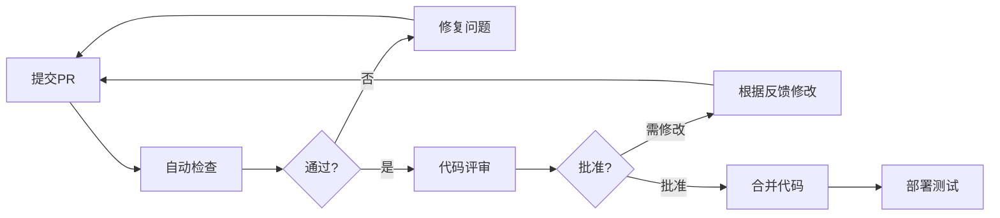

# CODE-QUALITY.md — IDC运维系统代码质量完整指南

版本: 1.0.0  
创建日期: 2025-08-31  
关联文档: CLAUDE.md v2.3, CLAUDE-IDC.md v2.2  
适用范围: IDC运维管理系统前后端代码

## 目录

1. [核心理念](#1-核心理念)
2. [代码质量五大维度](#2-代码质量五大维度)
3. [具体实践标准](#3-具体实践标准)
4. [IDC项目特定规范](#4-idc项目特定规范)
5. [代码评审指南](#5-代码评审指南)
6. [量化指标体系](#6-量化指标体系)
7. [重构指南](#7-重构指南)
8. [工具链配置](#8-工具链配置)
9. [最佳实践案例库](#9-最佳实践案例库)
10. [持续改进机制](#10-持续改进机制)

## 1. 核心理念

### 1.1 质量金字塔

```
        ┌─────┐
        │ 美观 │      - 代码风格统一、布局优雅
       ┌┴─────┴┐
       │ 高效  │     - 性能优良、资源节约
      ┌┴───────┴┐
      │  扩展   │    - 易于修改、适应变化
     ┌┴─────────┴┐
     │   健壮    │   - 错误处理、边界清晰
    ┌┴───────────┴┐
    │    清晰     │  - 意图明确、自解释
   └───────────────┘
```

### 1.2 核心原则

- **代码是负债，功能是资产** - 用最少代码实现最大价值
- **为人类而写** - 代码首先是给人看的，其次才是机器执行
- **Boy Scout Rule** - 离开时的代码比来时更干净
- **KISS原则** - Keep It Simple, Stupid
- **DRY原则** - Don't Repeat Yourself
- **YAGNI原则** - You Aren't Gonna Need It

## 2. 代码质量五大维度

### 2.1 可读性（Readability）- 权重30%

#### 定义
代码能否被团队成员快速理解，包括逻辑流程、业务意图和实现细节。

#### 评判标准

```javascript
// ❌ 差的可读性
const d = (p, r, t) => p * Math.pow(1 + r, t);
const x = u.f ? u.n.substr(0,1).toUpperCase() + u.n.substr(1) : u.n;
if(t.s==1&&(Date.now()-t.c)>86400000) t.s=2;

// ✅ 优秀的可读性
const calculateCompoundInterest = (principal, rate, time) => {
  return principal * Math.pow(1 + rate, time);
};

const formatUsername = (user) => {
  if (user.isVip) {
    return user.name.charAt(0).toUpperCase() + user.name.slice(1);
  }
  return user.name;
};

const TICKET_STATUS = {
  PENDING: 1,
  PROCESSING: 2
};
const ONE_DAY_MS = 24 * 60 * 60 * 1000;

if (ticket.status === TICKET_STATUS.PENDING && 
    (Date.now() - ticket.createTime) > ONE_DAY_MS) {
  ticket.status = TICKET_STATUS.PROCESSING;
}
```

#### 具体要求
- 变量名称有意义且符合业务领域
- 函数名称准确描述其行为
- 复杂逻辑有清晰注释
- 代码结构层次分明
- 避免过深嵌套（<4层）

### 2.2 可维护性（Maintainability）- 权重25%

#### 定义
代码能否方便地修改、扩展和调试，包括模块化程度、依赖管理和文档完整性。

#### 评判标准

```javascript
// ❌ 难以维护
class TicketManager {
  processAll() {
    const tickets = db.query('SELECT * FROM tickets');
    tickets.forEach(t => {
      if (t.type === 1) {
        // 处理类型1
        if (t.priority === 'high') {
          sendEmail(admin@company.com, 'High priority ticket');
          t.assignee = 'John';
        }
      } else if (t.type === 2) {
        // 处理类型2
        updateDatabase(t);
        logToFile('/var/log/tickets.log', t);
      }
      // 更多硬编码逻辑...
    });
  }
}

// ✅ 易于维护
class TicketProcessor {
  constructor(repository, notifier, logger, config) {
    this.repository = repository;
    this.notifier = notifier;
    this.logger = logger;
    this.config = config;
  }

  async processTickets() {
    const tickets = await this.repository.getPendingTickets();
    const processors = this.getProcessors();
    
    for (const ticket of tickets) {
      const processor = processors[ticket.type];
      if (processor) {
        await processor.process(ticket);
      }
    }
  }

  getProcessors() {
    return {
      [TICKET_TYPE.INCIDENT]: new IncidentProcessor(this.notifier),
      [TICKET_TYPE.REQUEST]: new RequestProcessor(this.logger),
      [TICKET_TYPE.CHANGE]: new ChangeProcessor(this.config)
    };
  }
}
```

#### 具体要求
- 单一职责原则（SRP）
- 依赖注入而非硬编码
- 配置外部化
- 模块间低耦合
- 有完整的错误恢复机制

### 2.3 可测试性（Testability）- 权重20%

#### 定义
代码能否方便地编写单元测试和集成测试，包括依赖隔离、副作用控制和边界清晰。

#### 评判标准

```javascript
// ❌ 难以测试
class InspectionService {
  checkAndAlert() {
    const items = database.query('SELECT * FROM inspection_items');
    items.forEach(item => {
      if (item.value > item.threshold) {
        const ticket = new Ticket();
        ticket.title = `异常: ${item.name}`;
        ticket.priority = 'high';
        ticket.save();
        emailService.send(getAdminEmail(), ticket.title);
        smsService.send(getOnCallPhone(), ticket.title);
      }
    });
  }
}

// ✅ 易于测试
class InspectionService {
  constructor(itemRepository, ticketFactory, notificationService) {
    this.itemRepository = itemRepository;
    this.ticketFactory = ticketFactory;
    this.notificationService = notificationService;
  }

  async checkItems() {
    const items = await this.itemRepository.getActiveItems();
    const anomalies = this.detectAnomalies(items);
    const tickets = await this.createTickets(anomalies);
    await this.notify(tickets);
    return { items: items.length, anomalies: anomalies.length, tickets: tickets.length };
  }

  detectAnomalies(items) {
    return items.filter(item => this.isAnomaly(item));
  }

  isAnomaly(item) {
    return item.value > item.threshold;
  }

  async createTickets(anomalies) {
    return Promise.all(
      anomalies.map(anomaly => this.ticketFactory.create(anomaly))
    );
  }

  async notify(tickets) {
    if (tickets.length > 0) {
      await this.notificationService.notifyAdmins(tickets);
    }
  }
}

// 对应的测试
describe('InspectionService', () => {
  it('should detect anomalies correctly', () => {
    const service = new InspectionService();
    const items = [
      { value: 100, threshold: 80 },  // 异常
      { value: 50, threshold: 80 }    // 正常
    ];
    const anomalies = service.detectAnomalies(items);
    expect(anomalies).toHaveLength(1);
  });
});
```

#### 具体要求
- 纯函数优于副作用函数
- 依赖注入支持Mock
- 避免直接操作全局状态
- 输入输出明确
- 边界条件可测

### 2.4 性能效率（Performance）- 权重15%

#### 定义
代码执行效率和资源使用情况，包括时间复杂度、空间复杂度和I/O优化。

#### 评判标准

```javascript
// ❌ 性能问题
// O(n³) 复杂度
function findTriplicate(arr) {
  const results = [];
  for (let i = 0; i < arr.length; i++) {
    for (let j = 0; j < arr.length; j++) {
      for (let k = 0; k < arr.length; k++) {
        if (arr[i] === arr[j] && arr[j] === arr[k] && i !== j && j !== k) {
          results.push(arr[i]);
        }
      }
    }
  }
  return results;
}

// N+1 查询问题
async function getTicketsWithUsers() {
  const tickets = await db.query('SELECT * FROM tickets');
  for (const ticket of tickets) {
    ticket.user = await db.query(`SELECT * FROM users WHERE id = ${ticket.userId}`);
  }
  return tickets;
}

// ✅ 性能优化
// O(n) 复杂度
function findTriplicate(arr) {
  const countMap = new Map();
  arr.forEach(item => {
    countMap.set(item, (countMap.get(item) || 0) + 1);
  });
  return Array.from(countMap.entries())
    .filter(([_, count]) => count >= 3)
    .map(([item]) => item);
}

// 批量查询
async function getTicketsWithUsers() {
  const tickets = await db.query('SELECT * FROM tickets');
  const userIds = [...new Set(tickets.map(t => t.userId))];
  const users = await db.query('SELECT * FROM users WHERE id IN (?)', [userIds]);
  const userMap = new Map(users.map(u => [u.id, u]));
  
  return tickets.map(ticket => ({
    ...ticket,
    user: userMap.get(ticket.userId)
  }));
}

// 缓存优化
class TicketService {
  constructor() {
    this.cache = new Map();
  }

  async getTicket(id) {
    if (this.cache.has(id)) {
      return this.cache.get(id);
    }
    
    const ticket = await db.query('SELECT * FROM tickets WHERE id = ?', [id]);
    this.cache.set(id, ticket);
    
    // 设置过期时间
    setTimeout(() => this.cache.delete(id), 60000);
    
    return ticket;
  }
}
```

#### 具体要求
- 算法复杂度合理（通常O(n²)以下）
- 避免N+1查询
- 合理使用缓存
- 批量操作优于循环单操作
- 异步并发优于串行

### 2.5 安全性（Security）- 权重10%

#### 定义
代码能否防范常见安全威胁，包括注入攻击、认证授权、数据加密等。

#### 评判标准

```javascript
// ❌ 安全隐患
// SQL注入风险
app.get('/user', (req, res) => {
  const userId = req.query.id;
  const query = `SELECT * FROM users WHERE id = ${userId}`;
  db.query(query);
});

// XSS风险
app.get('/search', (req, res) => {
  const keyword = req.query.q;
  res.send(`<h1>搜索结果: ${keyword}</h1>`);
});

// 敏感信息泄露
console.log('User password:', user.password);
localStorage.setItem('token', sensitiveToken);

// ✅ 安全实践
// 参数化查询
app.get('/user', (req, res) => {
  const userId = req.query.id;
  const query = 'SELECT * FROM users WHERE id = ?';
  db.query(query, [userId]);
});

// XSS防护
import DOMPurify from 'dompurify';
app.get('/search', (req, res) => {
  const keyword = DOMPurify.sanitize(req.query.q);
  res.send(`<h1>搜索结果: ${keyword}</h1>`);
});

// 敏感信息保护
console.log('User login:', user.username);  // 不输出密码
sessionStorage.setItem('token', token);      // 使用sessionStorage
const hashedPassword = bcrypt.hashSync(password, 10);  // 密码加密
```

#### 具体要求
- 所有输入必须验证
- 使用参数化查询
- 敏感数据加密存储
- 实施最小权限原则
- 安全的错误处理

## 3. 具体实践标准

### 3.1 命名规范

```javascript
// 常量：大写下划线
const MAX_RETRY_COUNT = 3;
const API_BASE_URL = 'https://api.example.com';

// 类名：PascalCase
class TicketProcessor {}
class InspectionService {}

// 函数/方法：camelCase，动词开头
function calculatePrice() {}
function getUserById() {}
function isValid() {}
function hasPermission() {}

// 变量：camelCase，名词
const ticketList = [];
const userProfile = {};

// 私有成员：下划线前缀
class Service {
  constructor() {
    this._privateData = [];
  }
  
  _privateMethod() {}
}

// 布尔值：is/has/can/should前缀
const isActive = true;
const hasPermission = false;
const canEdit = true;
const shouldUpdate = false;
```

### 3.2 函数设计原则

```javascript
// 单一职责
// ❌ 做太多事情
function processTicket(ticket) {
  // 验证
  if (!ticket.title) throw new Error('Title required');
  
  // 计算优先级
  if (ticket.type === 'urgent') {
    ticket.priority = 'high';
  }
  
  // 保存
  db.save(ticket);
  
  // 发送通知
  email.send(ticket);
  
  return ticket;
}

// ✅ 职责分离
function validateTicket(ticket) {
  if (!ticket.title) throw new Error('Title required');
  return true;
}

function calculatePriority(ticket) {
  if (ticket.type === 'urgent') {
    return 'high';
  }
  return 'normal';
}

async function saveTicket(ticket) {
  return await db.save(ticket);
}

async function notifyTicketCreation(ticket) {
  return await email.send(ticket);
}

// 参数数量限制（最多3个）
// ❌ 参数过多
function createTicket(title, description, priority, assignee, dueDate, tags) {}

// ✅ 使用对象参数
function createTicket({ title, description, priority, assignee, dueDate, tags }) {}

// 返回值一致性
// ❌ 不一致的返回
function getUser(id) {
  if (!id) return null;
  const user = db.find(id);
  if (!user) return false;
  return user;
}

// ✅ 一致的返回
function getUser(id) {
  if (!id) return null;
  return db.find(id) || null;
}
```

### 3.3 错误处理规范

```javascript
// 自定义错误类
class BusinessError extends Error {
  constructor(message, code) {
    super(message);
    this.name = 'BusinessError';
    this.code = code;
  }
}

class ValidationError extends BusinessError {
  constructor(field, value) {
    super(`Invalid ${field}: ${value}`, 'VALIDATION_ERROR');
    this.field = field;
    this.value = value;
  }
}

// 错误处理策略
async function handleTicketCreation(data) {
  try {
    // 输入验证
    if (!data.title) {
      throw new ValidationError('title', data.title);
    }
    
    // 业务逻辑
    const ticket = await createTicket(data);
    
    // 成功响应
    return {
      success: true,
      data: ticket
    };
    
  } catch (error) {
    // 分类处理
    if (error instanceof ValidationError) {
      console.warn('Validation failed:', error.message);
      return {
        success: false,
        error: error.message,
        code: error.code
      };
    }
    
    if (error instanceof BusinessError) {
      console.error('Business error:', error);
      return {
        success: false,
        error: 'Operation failed',
        code: error.code
      };
    }
    
    // 未知错误
    console.error('Unexpected error:', error);
    return {
      success: false,
      error: 'Internal server error',
      code: 'INTERNAL_ERROR'
    };
  }
}
```

## 4. IDC项目特定规范

### 4.1 工单模块规范

```javascript
// 工单状态必须使用状态机
const TicketStateMachine = {
  PENDING: {
    canTransitionTo: ['ASSIGNED'],
    actions: {
      onEnter: (ticket) => ticket.pendingAt = Date.now(),
      onExit: (ticket) => ticket.pendingDuration = Date.now() - ticket.pendingAt
    }
  },
  ASSIGNED: {
    canTransitionTo: ['PROCESSING', 'PENDING'],
    validations: {
      beforeEnter: (ticket) => !!ticket.assignee
    }
  },
  PROCESSING: {
    canTransitionTo: ['COMPLETED', 'ASSIGNED'],
    timeLimit: 4 * 60 * 60 * 1000  // 4小时
  },
  COMPLETED: {
    canTransitionTo: ['CLOSED'],
    actions: {
      onEnter: (ticket) => {
        ticket.completedAt = Date.now();
        ticket.resolutionTime = ticket.completedAt - ticket.createdAt;
      }
    }
  },
  CLOSED: {
    canTransitionTo: [],
    final: true
  }
};

// 工单升级必须记录审计日志
class TicketEscalationService {
  async escalateTicket(ticket, reason) {
    const oldPriority = ticket.priority;
    const newPriority = this.getNextPriority(oldPriority);
    
    // 记录审计日志
    await this.auditLog.record({
      action: 'TICKET_ESCALATED',
      ticketId: ticket.id,
      oldPriority,
      newPriority,
      reason,
      timestamp: Date.now(),
      automatic: true
    });
    
    // 更新工单
    ticket.priority = newPriority;
    ticket.escalationCount = (ticket.escalationCount || 0) + 1;
    ticket.lastEscalation = Date.now();
    
    // 通知相关人员
    await this.notifyEscalation(ticket, oldPriority, newPriority);
    
    return ticket;
  }
}
```

### 4.2 巡检模块规范

```javascript
// 巡检项配置必须集中管理
const InspectionConfig = {
  // 数值型检查项
  NUMERIC_ITEMS: {
    TEMPERATURE: {
      name: '温度',
      unit: '°C',
      normalRange: { min: 18, max: 26 },
      warningRange: { min: 15, max: 28 },
      criticalRange: { min: 10, max: 35 }
    },
    HUMIDITY: {
      name: '湿度',
      unit: '%',
      normalRange: { min: 40, max: 60 },
      warningRange: { min: 35, max: 65 },
      criticalRange: { min: 30, max: 70 }
    }
  },
  
  // 优先级判定规则必须明确
  getPriority(item, value) {
    const config = this.NUMERIC_ITEMS[item.type];
    if (!config) return 'low';
    
    const { normalRange, warningRange, criticalRange } = config;
    
    if (value < criticalRange.min || value > criticalRange.max) {
      return 'critical';
    }
    if (value < warningRange.min || value > warningRange.max) {
      return 'high';
    }
    if (value < normalRange.min || value > normalRange.max) {
      return 'medium';
    }
    return 'low';
  }
};

// 异常检测必须可追溯
class InspectionAnomalyDetector {
  detectAnomalies(inspectionData) {
    const anomalies = [];
    
    for (const item of inspectionData.items) {
      const result = this.checkItem(item);
      
      if (result.isAnomaly) {
        anomalies.push({
          itemId: item.id,
          itemName: item.name,
          value: item.value,
          threshold: result.threshold,
          severity: result.severity,
          rule: result.appliedRule,  // 记录应用的规则
          suggestion: result.suggestion,
          detectedAt: Date.now()
        });
      }
    }
    
    return {
      anomalies,
      summary: this.generateSummary(anomalies),
      recommendations: this.generateRecommendations(anomalies)
    };
  }
}
```

### 4.3 维保计划规范

```javascript
// 维保计划必须支持版本控制
class MaintenancePlan {
  constructor(data) {
    this.id = data.id;
    this.version = data.version || '1.0.0';
    this.history = [];
  }
  
  update(changes, userId) {
    // 保存历史版本
    this.history.push({
      version: this.version,
      data: this.toJSON(),
      changedBy: userId,
      changedAt: Date.now(),
      changes: this.diffChanges(changes)
    });
    
    // 更新版本号
    this.version = this.incrementVersion();
    
    // 应用变更
    Object.assign(this, changes);
    
    return this;
  }
  
  incrementVersion() {
    const [major, minor, patch] = this.version.split('.').map(Number);
    return `${major}.${minor}.${patch + 1}`;
  }
  
  rollback(version) {
    const historicalVersion = this.history.find(h => h.version === version);
    if (!historicalVersion) {
      throw new Error(`Version ${version} not found`);
    }
    
    // 记录回滚操作
    this.history.push({
      version: this.version,
      data: this.toJSON(),
      action: 'ROLLBACK',
      rollbackTo: version,
      rolledBackAt: Date.now()
    });
    
    // 恢复数据
    Object.assign(this, historicalVersion.data);
    this.version = `${historicalVersion.version}-rollback`;
    
    return this;
  }
}
```

## 5. 代码评审指南

### 5.1 评审检查清单

#### 必须通过项（MUST PASS）
- [ ] **功能正确性**：代码实现了需求的功能
- [ ] **无明显Bug**：没有明显的逻辑错误
- [ ] **安全检查**：无SQL注入、XSS等安全漏洞
- [ ] **错误处理**：有基本的异常捕获和处理
- [ ] **测试覆盖**：关键逻辑有测试用例
- [ ] **文档完整**：复杂逻辑有注释说明

#### 应该满足项（SHOULD MEET）
- [ ] **命名规范**：遵循项目命名约定
- [ ] **代码风格**：通过ESLint/Prettier检查
- [ ] **性能考虑**：无明显性能问题
- [ ] **代码重复**：DRY原则，无大量重复代码
- [ ] **函数长度**：单个函数不超过50行
- [ ] **圈复杂度**：单个函数圈复杂度<10

#### 建议改进项（NICE TO HAVE）
- [ ] **设计模式**：合理使用设计模式
- [ ] **优雅实现**：代码简洁优雅
- [ ] **扩展性**：易于未来扩展
- [ ] **性能优化**：有性能优化考虑
- [ ] **创新思路**：有创新的解决方案

### 5.2 评审流程



### 5.3 评审反馈模板

```markdown
## 代码评审反馈

### ✅ 做得好的地方
- 清晰的函数命名
- 完整的错误处理
- 良好的测试覆盖

### ⚠️ 必须修改
1. **[安全]** 第45行存在SQL注入风险
   ```javascript
   // 建议使用参数化查询
   db.query('SELECT * FROM users WHERE id = ?', [userId])
   ```

2. **[Bug]** 第78行可能出现空指针异常
   ```javascript
   // 建议添加空值检查
   if (user && user.profile) { ... }
   ```

### 💡 建议改进
1. **[性能]** 第120行可以使用Map优化查找
2. **[可读性]** 第156行的条件判断可以简化

### 📚 学习资源
- [SQL注入防护最佳实践](link)
- [JavaScript性能优化技巧](link)
```

## 6. 量化指标体系

### 6.1 代码质量指标

| 指标 | 优秀 | 良好 | 及格 | 需改进 | 测量工具 |
|------|------|------|------|--------|----------|
| **测试覆盖率** | >85% | 70-85% | 60-70% | <60% | Jest/Vitest |
| **代码重复率** | <3% | 3-5% | 5-10% | >10% | jscpd |
| **圈复杂度** | <5 | 5-10 | 10-20 | >20 | ESLint |
| **技术债务比** | <5% | 5-10% | 10-20% | >20% | SonarQube |
| **代码规范违规** | 0 | <5/千行 | 5-10/千行 | >10/千行 | ESLint |
| **函数长度** | <20行 | 20-30行 | 30-50行 | >50行 | ESLint |
| **依赖过时率** | 0% | <10% | 10-30% | >30% | npm audit |
| **构建时间** | <30s | 30-60s | 60-120s | >120s | Webpack |
| **包体积** | <500KB | 500KB-1MB | 1-2MB | >2MB | Bundle Analyzer |

### 6.2 项目健康度评分

```javascript
class ProjectHealthCalculator {
  calculate(metrics) {
    const weights = {
      coverage: 0.25,      // 测试覆盖率
      duplication: 0.15,   // 代码重复
      complexity: 0.20,    // 复杂度
      violations: 0.15,    // 规范违规
      performance: 0.15,   // 性能指标
      documentation: 0.10  // 文档完整度
    };
    
    const scores = {
      coverage: this.scoreCoverage(metrics.coverage),
      duplication: this.scoreDuplication(metrics.duplication),
      complexity: this.scoreComplexity(metrics.complexity),
      violations: this.scoreViolations(metrics.violations),
      performance: this.scorePerformance(metrics.performance),
      documentation: this.scoreDocumentation(metrics.documentation)
    };
    
    const totalScore = Object.keys(scores).reduce((sum, key) => {
      return sum + scores[key] * weights[key];
    }, 0);
    
    return {
      totalScore: Math.round(totalScore),
      breakdown: scores,
      level: this.getLevel(totalScore),
      recommendations: this.getRecommendations(scores)
    };
  }
  
  getLevel(score) {
    if (score >= 90) return 'S';  // 卓越
    if (score >= 80) return 'A';  // 优秀
    if (score >= 70) return 'B';  // 良好
    if (score >= 60) return 'C';  // 及格
    return 'D';  // 需改进
  }
}
```

## 7. 重构指南

### 7.1 何时重构

- **Rule of Three**：相同代码出现3次时
- **添加功能困难**：现有结构难以支持新功能
- **Bug频发**：同一模块反复出现问题
- **性能瓶颈**：代码成为性能瓶颈
- **理解困难**：团队成员难以理解代码

### 7.2 重构步骤

```javascript
// Step 1: 识别问题代码
// 原始代码：多重职责、硬编码、难以测试
class ReportGenerator {
  generate(type) {
    let data;
    if (type === 'daily') {
      data = db.query('SELECT * FROM tickets WHERE date = TODAY');
      const html = '<h1>Daily Report</h1>';
      // 100行HTML拼接...
      sendEmail('admin@company.com', html);
    } else if (type === 'weekly') {
      data = db.query('SELECT * FROM tickets WHERE date > LAST_WEEK');
      const html = '<h1>Weekly Report</h1>';
      // 100行HTML拼接...
      sendEmail('admin@company.com', html);
    }
  }
}

// Step 2: 编写测试保护
describe('ReportGenerator', () => {
  it('should generate daily report', () => {
    // 测试现有功能
  });
});

// Step 3: 提取方法
class ReportGenerator {
  generate(type) {
    const data = this.fetchData(type);
    const html = this.renderReport(type, data);
    this.sendReport(html);
  }
  
  fetchData(type) {
    const queries = {
      daily: 'SELECT * FROM tickets WHERE date = TODAY',
      weekly: 'SELECT * FROM tickets WHERE date > LAST_WEEK'
    };
    return db.query(queries[type]);
  }
}

// Step 4: 引入策略模式
class ReportStrategy {
  fetchData() { throw new Error('Must implement'); }
  render(data) { throw new Error('Must implement'); }
}

class DailyReportStrategy extends ReportStrategy {
  fetchData() {
    return db.query('SELECT * FROM tickets WHERE date = TODAY');
  }
  
  render(data) {
    return this.template.render('daily', data);
  }
}

// Step 5: 依赖注入
class ReportGenerator {
  constructor(strategy, notifier) {
    this.strategy = strategy;
    this.notifier = notifier;
  }
  
  async generate() {
    const data = await this.strategy.fetchData();
    const report = await this.strategy.render(data);
    await this.notifier.send(report);
    return report;
  }
}
```

### 7.3 重构技巧清单

- **提取方法**：将长函数拆分为多个小函数
- **内联方法**：消除不必要的间接调用
- **提取变量**：用变量名解释复杂表达式
- **内联变量**：消除不必要的临时变量
- **改名**：使用更准确的名称
- **搬移方法**：将方法移到更合适的类
- **提取类**：将大类拆分为多个小类
- **内联类**：合并过度设计的小类
- **隐藏委托关系**：减少耦合
- **移除中间人**：消除不必要的委托

## 8. 工具链配置

### 8.1 ESLint配置

```javascript
// .eslintrc.js
module.exports = {
  extends: [
    'eslint:recommended',
    'plugin:vue/vue3-recommended',
    '@vue/typescript/recommended'
  ],
  rules: {
    // 代码质量
    'complexity': ['error', 10],
    'max-depth': ['error', 4],
    'max-lines': ['error', 300],
    'max-lines-per-function': ['error', 50],
    'max-params': ['error', 3],
    'max-statements': ['error', 15],
    
    // 命名规范
    'camelcase': 'error',
    'id-length': ['error', { min: 2, max: 30 }],
    
    // 最佳实践
    'no-eval': 'error',
    'no-implied-eval': 'error',
    'no-new-func': 'error',
    'no-return-await': 'error',
    'prefer-promise-reject-errors': 'error',
    'require-await': 'error'
  }
};
```

### 8.2 提交规范

```bash
# commitlint.config.js
module.exports = {
  extends: ['@commitlint/config-conventional'],
  rules: {
    'type-enum': [2, 'always', [
      'feat',     // 新功能
      'fix',      // 修复bug
      'docs',     // 文档更新
      'style',    // 代码格式
      'refactor', // 重构
      'perf',     // 性能优化
      'test',     // 测试
      'chore',    // 构建/工具
      'revert'    // 回滚
    ]],
    'subject-max-length': [2, 'always', 72],
    'body-max-line-length': [2, 'always', 100]
  }
};

# 提交示例
git commit -m "feat(ticket): 添加工单批量分配功能

- 支持多选工单
- 支持按规则自动分配
- 添加分配历史记录

Closes #123"
```

### 8.3 CI质量门禁

```yaml
# .github/workflows/quality.yml
name: Code Quality Check

on: [push, pull_request]

jobs:
  quality:
    runs-on: ubuntu-latest
    steps:
      - uses: actions/checkout@v2
      
      # 代码规范检查
      - name: Lint
        run: |
          npm run lint
          if [ $? -ne 0 ]; then exit 1; fi
      
      # 测试覆盖率
      - name: Test Coverage
        run: |
          npm run test:coverage
          coverage=$(cat coverage/coverage-summary.json | jq '.total.lines.pct')
          if (( $(echo "$coverage < 70" | bc -l) )); then
            echo "Coverage too low: $coverage%"
            exit 1
          fi
      
      # 复杂度检查
      - name: Complexity Check
        run: |
          npx plato -r -d report src
          complexity=$(cat report/report.json | jq '.summary.average.maintainability')
          if (( $(echo "$complexity < 70" | bc -l) )); then
            echo "Code complexity too high"
            exit 1
          fi
      
      # 依赖安全检查
      - name: Security Audit
        run: npm audit --audit-level=high
      
      # SonarQube扫描
      - name: SonarQube Scan
        uses: sonarsource/sonarqube-scan-action@master
        env:
          SONAR_TOKEN: ${{ secrets.SONAR_TOKEN }}
```

## 9. 最佳实践案例库

### 9.1 API设计最佳实践

```javascript
// RESTful API设计
class TicketAPI {
  // 统一的响应格式
  static formatResponse(success, data = null, error = null, meta = {}) {
    return {
      success,
      data,
      error,
      meta: {
        timestamp: Date.now(),
        version: '1.0.0',
        ...meta
      }
    };
  }
  
  // 分页查询
  async list(req, res) {
    try {
      const { page = 1, pageSize = 20, ...filters } = req.query;
      
      const tickets = await this.ticketService.find(filters, {
        offset: (page - 1) * pageSize,
        limit: pageSize
      });
      
      const total = await this.ticketService.count(filters);
      
      return res.json(this.formatResponse(true, tickets, null, {
        pagination: {
          page: Number(page),
          pageSize: Number(pageSize),
          total,
          totalPages: Math.ceil(total / pageSize)
        }
      }));
    } catch (error) {
      return res.status(500).json(
        this.formatResponse(false, null, error.message)
      );
    }
  }
  
  // 批量操作
  async batchUpdate(req, res) {
    const { ids, updates } = req.body;
    
    // 验证
    if (!Array.isArray(ids) || ids.length === 0) {
      return res.status(400).json(
        this.formatResponse(false, null, 'Invalid ids')
      );
    }
    
    // 事务处理
    const results = await this.db.transaction(async (trx) => {
      return Promise.all(
        ids.map(id => this.ticketService.update(id, updates, { trx }))
      );
    });
    
    return res.json(this.formatResponse(true, {
      updated: results.length,
      ids: results.map(r => r.id)
    }));
  }
}
```

### 9.2 状态管理最佳实践

```javascript
// Vuex模块化设计
const ticketModule = {
  namespaced: true,
  
  state: () => ({
    list: [],
    current: null,
    loading: false,
    error: null,
    filters: {
      status: '',
      priority: '',
      assignee: ''
    },
    pagination: {
      page: 1,
      pageSize: 20,
      total: 0
    }
  }),
  
  getters: {
    // 派生状态
    pendingTickets: (state) => 
      state.list.filter(t => t.status === 'pending'),
    
    highPriorityTickets: (state) => 
      state.list.filter(t => t.priority === 'high'),
    
    myTickets: (state, getters, rootState) => 
      state.list.filter(t => t.assignee === rootState.user.id)
  },
  
  mutations: {
    // 同步更新
    SET_LOADING(state, loading) {
      state.loading = loading;
    },
    
    SET_LIST(state, list) {
      state.list = list;
    },
    
    UPDATE_TICKET(state, { id, updates }) {
      const index = state.list.findIndex(t => t.id === id);
      if (index !== -1) {
        state.list[index] = { ...state.list[index], ...updates };
      }
    }
  },
  
  actions: {
    // 异步操作
    async fetchTickets({ commit, state }) {
      commit('SET_LOADING', true);
      try {
        const { data } = await api.getTickets({
          ...state.filters,
          ...state.pagination
        });
        commit('SET_LIST', data.list);
        commit('SET_PAGINATION', data.pagination);
      } catch (error) {
        commit('SET_ERROR', error.message);
      } finally {
        commit('SET_LOADING', false);
      }
    },
    
    // 乐观更新
    async updateTicketOptimistic({ commit }, { id, updates }) {
      // 立即更新UI
      commit('UPDATE_TICKET', { id, updates });
      
      try {
        // 发送请求
        await api.updateTicket(id, updates);
      } catch (error) {
        // 失败回滚
        commit('ROLLBACK_TICKET', { id });
        throw error;
      }
    }
  }
};
```

### 9.3 组件设计最佳实践

```vue
<!-- TicketList.vue -->
<template>
  <div class="ticket-list">
    <!-- 搜索栏 -->
    <ticket-filter 
      v-model="filters"
      @search="handleSearch"
    />
    
    <!-- 列表 -->
    <el-table 
      v-loading="loading"
      :data="tickets"
      @sort-change="handleSort"
    >
      <el-table-column 
        v-for="column in columns" 
        :key="column.prop"
        v-bind="column"
      >
        <template v-if="column.slot" #default="scope">
          <slot :name="column.slot" v-bind="scope" />
        </template>
      </el-table-column>
    </el-table>
    
    <!-- 分页 -->
    <pagination 
      v-model:page="pagination.page"
      v-model:size="pagination.pageSize"
      :total="pagination.total"
      @change="fetchData"
    />
  </div>
</template>

<script setup>
import { ref, computed, watch } from 'vue';
import { useStore } from 'vuex';
import { useRouter } from 'vue-router';
import { debounce } from 'lodash-es';

// Props定义
const props = defineProps({
  // 使用TypeScript风格的类型定义
  status: {
    type: String,
    default: '',
    validator: (value) => ['', 'pending', 'processing', 'completed'].includes(value)
  },
  
  // 列配置
  columns: {
    type: Array,
    default: () => [
      { prop: 'id', label: 'ID', width: 80 },
      { prop: 'title', label: '标题', minWidth: 200 },
      { prop: 'status', label: '状态', width: 120, slot: 'status' },
      { prop: 'priority', label: '优先级', width: 100, slot: 'priority' },
      { prop: 'assignee', label: '处理人', width: 150 },
      { prop: 'createTime', label: '创建时间', width: 180 }
    ]
  }
});

// Composables
const store = useStore();
const router = useRouter();

// 响应式数据
const filters = ref({
  keyword: '',
  status: props.status,
  priority: '',
  dateRange: []
});

const pagination = ref({
  page: 1,
  pageSize: 20,
  total: 0
});

// 计算属性
const tickets = computed(() => store.state.ticket.list);
const loading = computed(() => store.state.ticket.loading);

// 方法
const fetchData = async () => {
  await store.dispatch('ticket/fetchTickets', {
    ...filters.value,
    ...pagination.value
  });
};

// 防抖搜索
const handleSearch = debounce(() => {
  pagination.value.page = 1;
  fetchData();
}, 300);

// 监听器
watch(() => props.status, (newStatus) => {
  filters.value.status = newStatus;
  fetchData();
});

// 生命周期
onMounted(() => {
  fetchData();
});

// 暴露给父组件
defineExpose({
  refresh: fetchData,
  filters,
  pagination
});
</script>
```

## 10. 持续改进机制

### 10.1 测试桩与组件模拟（E2E/单测稳定性）
- 为 UI 组件库准备“最小可渲染桩”，避免真实渲染差异造成的 flaky：
  - 在 `src/__tests__/setup.ts` 里全局注册 Element Plus 常用组件桩与 `v-loading` 指令。
  - `el-button` 禁用语义以“属性存在性”为准：禁用时渲染 `disabled="disabled"`；启用时不输出 `disabled` 属性。
- 对涉及异步确认/渲染的断言，统一在断言前执行：`await Promise.resolve(); await new Promise(r=>setTimeout(r,0)); await nextTick()`。
- 对路由跳转断言，优先断言“发生跳转且包含目标前缀”，避免硬编码 ID 造成用例脆弱。

### 10.2 编码安全策略（乱码/编码问题）
- 严禁任何“一键编码转换脚本”或批量“改为 UTF-8”的操作。
- 仅对“确有乱码的片段”做定点、最小修改；新增文件统一保存为 UTF-8。
- 若需批量修复，先单测/预编译定位阻断构建的行，再逐行手修，严控变更范围。

### 10.3 数据权限参数对齐（mineOnly 别名）
- 使用 `VITE_API_MINE_ONLY_PARAM` 配置后端实际参数名，默认 `mineOnly`。
- 利用 `withMineOnly(payload, isAdmin)` 注入，保证非管理员列表/nearDue/overdue 均携带过滤参数；别名阶段“双写”以便灰度。

### 10.1 质量趋势跟踪

```javascript
class QualityTrendTracker {
  constructor() {
    this.history = [];
    this.thresholds = {
      coverage: { baseline: 70, target: 80, excellent: 90 },
      complexity: { baseline: 10, target: 8, excellent: 5 },
      duplication: { baseline: 10, target: 5, excellent: 3 }
    };
  }
  
  recordMetrics(metrics) {
    const record = {
      timestamp: Date.now(),
      commit: process.env.GIT_COMMIT,
      branch: process.env.GIT_BRANCH,
      metrics: metrics,
      score: this.calculateScore(metrics)
    };
    
    this.history.push(record);
    this.analyzetrends();
    
    return record;
  }
  
  analyzetrends() {
    const recent = this.history.slice(-30);  // 最近30次
    
    const trends = {
      coverage: this.calculateTrend(recent, 'coverage'),
      complexity: this.calculateTrend(recent, 'complexity'),
      duplication: this.calculateTrend(recent, 'duplication')
    };
    
    // 生成报告
    this.generateReport(trends);
    
    // 自动调整阈值
    this.adjustThresholds(trends);
  }
  
  calculateTrend(data, metric) {
    if (data.length < 2) return 'stable';
    
    const values = data.map(d => d.metrics[metric]);
    const firstHalf = values.slice(0, Math.floor(values.length / 2));
    const secondHalf = values.slice(Math.floor(values.length / 2));
    
    const avgFirst = this.average(firstHalf);
    const avgSecond = this.average(secondHalf);
    
    const change = ((avgSecond - avgFirst) / avgFirst) * 100;
    
    if (Math.abs(change) < 5) return 'stable';
    return change > 0 ? 'improving' : 'declining';
  }
  
  adjustThresholds(trends) {
    // 如果连续改进，提高标准
    Object.keys(trends).forEach(metric => {
      if (trends[metric] === 'improving') {
        const current = this.thresholds[metric].baseline;
        const target = this.thresholds[metric].target;
        
        // 逐步提高基线
        this.thresholds[metric].baseline = current + (target - current) * 0.1;
      }
    });
  }
}
```

### 10.2 团队培训计划

```markdown
## 代码质量培训路线图

### 初级（0-6个月）
- [ ] 代码规范基础
- [ ] Git工作流程
- [ ] 单元测试入门
- [ ] 代码评审参与

### 中级（6-12个月）
- [ ] 设计模式实践
- [ ] 性能优化技巧
- [ ] 安全编码规范
- [ ] 重构技术

### 高级（12个月+）
- [ ] 架构设计原则
- [ ] 领域驱动设计
- [ ] 性能调优深入
- [ ] 代码评审主导

### 每周分享主题
- Week 1: 本周最佳代码
- Week 2: 本周问题案例
- Week 3: 新技术探索
- Week 4: 重构案例分析
```

### 10.3 激励机制

```javascript
class QualityIncentiveSystem {
  constructor() {
    this.achievements = {
      // 代码质量成就
      CLEAN_CODE: {
        name: '代码洁癖',
        description: '连续10个PR零规范违规',
        points: 100
      },
      TEST_MASTER: {
        name: '测试大师', 
        description: '测试覆盖率>95%',
        points: 150
      },
      REFACTOR_HERO: {
        name: '重构英雄',
        description: '成功重构复杂模块',
        points: 200
      },
      BUG_HUNTER: {
        name: 'Bug猎手',
        description: '发现并修复5个严重bug',
        points: 150
      },
      REVIEWER: {
        name: '评审专家',
        description: '完成50次高质量代码评审',
        points: 100
      }
    };
  }
  
  checkAchievements(developer) {
    const earned = [];
    
    // 检查各项成就
    if (developer.metrics.violations === 0 && developer.prCount >= 10) {
      earned.push(this.achievements.CLEAN_CODE);
    }
    
    if (developer.metrics.coverage > 95) {
      earned.push(this.achievements.TEST_MASTER);
    }
    
    // 记录成就
    developer.achievements = [...developer.achievements, ...earned];
    
    // 计算积分
    developer.points = earned.reduce((sum, a) => sum + a.points, developer.points || 0);
    
    return earned;
  }
  
  getLeaderboard() {
    return this.developers
      .sort((a, b) => b.points - a.points)
      .slice(0, 10);
  }
}
```

## 附录A：常用代码片段

```javascript
// VS Code代码片段配置
{
  "IDC Service Class": {
    "prefix": "idc-service",
    "body": [
      "import { Injectable } from '@/decorators';",
      "import { Logger } from '@/utils/logger';",
      "",
      "@Injectable()",
      "export class ${1:Service}Service {",
      "  constructor(",
      "    private readonly repository: ${1:Service}Repository,",
      "    private readonly logger: Logger",
      "  ) {}",
      "",
      "  async ${2:method}(${3:params}) {",
      "    try {",
      "      this.logger.info('${2:method} started', { ${3:params} });",
      "      ",
      "      const result = await this.repository.${2:method}(${3:params});",
      "      ",
      "      this.logger.info('${2:method} completed', { result });",
      "      return result;",
      "    } catch (error) {",
      "      this.logger.error('${2:method} failed', error);",
      "      throw error;",
      "    }",
      "  }",
      "}"
    ]
  }
}
```

## 附录B：相关资源

### 书籍推荐
- 《代码整洁之道》- Robert C. Martin
- 《重构：改善既有代码的设计》- Martin Fowler
- 《设计模式》- GoF
- 《领域驱动设计》- Eric Evans

### 在线资源
- [Google JavaScript Style Guide](https://google.github.io/styleguide/jsguide.html)
- [Airbnb JavaScript Style Guide](https://github.com/airbnb/javascript)
- [Vue.js Style Guide](https://vuejs.org/style-guide/)
- [OWASP Security Guide](https://owasp.org/www-project-top-ten/)

### 工具链接
- [ESLint](https://eslint.org/)
- [Prettier](https://prettier.io/)
- [SonarQube](https://www.sonarqube.org/)
- [Jest](https://jestjs.io/)
- [Vitest](https://vitest.dev/)

---

**文档维护说明**：
- 每季度更新一次指标基准
- 每月收集最佳实践案例
- 持续跟踪团队反馈并优化

**版本控制**：
- 使用语义化版本号
- 重大变更需团队评审
- 保留历史版本供参考
## 2025-09-06 Code Quality Update（Inspection/Ticket）

- UI/UX Consistency
  - 生成动作：按钮接入 `loading/disabled`；状态置位在二次确认之后；失败/取消需及时复位。
  - 文案统一：异常数量“项”、工单数量“个”、异常处理“率”。
- API Contract Safety
  - `generateTickets` 仅接收“异常对象数组”；前端严禁直接传 id。
  - 路由路径一致性：工单列表 `/business/ticket/list`。
- Testing
  - 单测：过滤（含空选择）、按钮态；集成：生成与跳转分支。
  - 运行：`npm test`；新增/修改生成逻辑必须附带或更新相关用例。
- Encoding Policy（强制）
  - 禁止“一键脚本/批量修改 UTF‑8”；仅对出现乱码的片段做手工修复。
  - 新文件统一 UTF‑8；旧文件不要整体改码。
- Code Style
  - 组件暴露仅用于测试（`defineExpose`）且限制范围。
  - 与后端契约相关的常量/类型放置在 `src/types` 或相邻 `utils`，便于溯源。
- Error Handling
  - 生成失败给出明确提示；控制台保留带上下文的错误日志（模块/方法/参数要点）。
## 2025-09-06 M2 Quality Addenda

- Pre-merge gates
  - Run `npm run type-check` and targeted vitest suites for maintenance detail flows
  - Verify sort whitelist and data-permission on `/business/maintenance/list` with non-admin
- Contract safety
  - Timelines read-only via `getPlanLogs(type=approval|execution)`; avoid mixing sources
  - Sort whitelist enforced at controller; mapper consumes only validated orderBy
- UX consistency
  - Empty-state and error-with-retry messages for approval/execution timelines
  - Buttons obey `loading/disabled` semantics; place line-level states before async calls
- Testing stability
  - Use global Element Plus stubs in `src/__tests__/setup.ts`
  - Wait for microtasks/render before asserting async UI state
- Encoding policy (strict)
  - No repository-wide re-encoding; only fix visible garbled slices
  - New files use UTF-8; older non-UTF-8 files remain untouched
